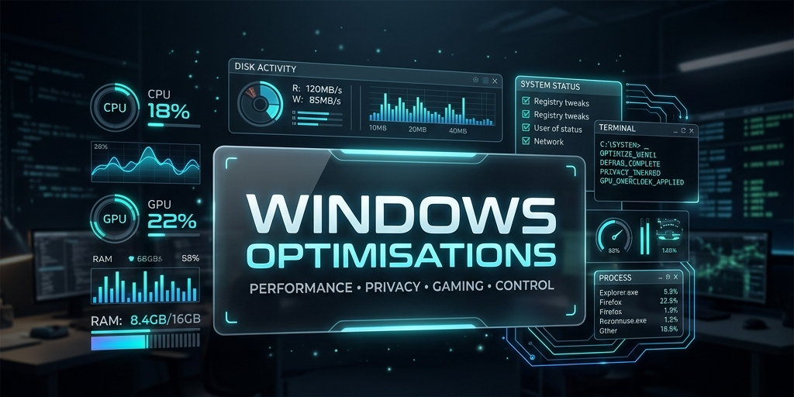

<div align="center">

<!-- ANIMATED CAPSULE-RENDER VENOM HEADER -->


<br>



<br><br>

<!-- ANIMATED TYPEWRITER BOOT SEQUENCE -->
[](https://github.com/YTxFSGAMERz/WinAurex)

<br>

<kbd>&nbsp;Windows Engineering Framework&nbsp;</kbd> &nbsp;•&nbsp; <kbd>&nbsp;Rollback-Safe&nbsp;</kbd> &nbsp;•&nbsp; <kbd>&nbsp;PowerShell + WPF&nbsp;</kbd> &nbsp;•&nbsp; <kbd>&nbsp;Open Source&nbsp;</kbd>

<br>

<a href="https://winaurex.vercel.app/"></a>

<br><br>

<!-- BADGE GRID — TWO-TONE DARK+NEON -->
<p align="center">
  <a href="#"></a>
  <a href="#"></a>
  <a href="#"></a>
  <a href="#"></a>
  <br>
  <a href="#"></a>
  <a href="#"></a>
  <a href="#"></a>
  <br>
  <a href="#"></a>
  <a href="#"></a>
  <br>
  <a href="#"></a>
  <a href="#"></a>
</p>

</div>

<!-- ═══ ANIMATED DIVIDER ═══ -->


<h2 align="center">⬛ THE C# & WPF EVOLUTION (V2.0)</h2>

<div align="center">

> Over **500+ Commits** later, WinAurex has evolved from a collection of raw PowerShell scripts into a **Robust C# WPF Engineering Platform**.

| 🚀 MAJOR UPGRADES | 🛡️ ENTERPRISE-GRADE SAFETY |
| :--- | :--- |
| **MVVM Architecture:** Clean separation of UI and business logic. | **C# Execution Engine:** Transactional state management in native .NET. |
| **WPF Dashboard UI:** A beautiful, responsive, cyber-aesthetic client. | **Validation & Dry-Runs:** Conflict detection before execution starts. |
| **Automated Testing:** Extensive xUnit test coverage ensuring reliability. | **Immutable Journaling:** Event-sourced audit trails for every operation. |
| **New Optimization Profiles:** Advanced PowerShell capability providers. | **Dependency Injection:** Loosely coupled components via `Contracts`. |

</div>

<!-- ═══ ANIMATED DIVIDER ═══ -->


<h2 align="center">⚡ QUICK START</h2>

<div align="center">

Get up and running in under 60 seconds.

```powershell
1. Download the latest release from the Releases Tab.
2. Extract and run WinAurex.App.exe as Administrator.
3. Select your desired profile (e.g., Gaming, Workstation) and click Execute.
```

</div>

<!-- ═══ ANIMATED DIVIDER ═══ -->


<h2 align="center">🛡️ WHY TRUST WINAUREX?</h2>

<div align="center">

Modifying your operating system requires absolute trust. We take security seriously.

| 🔒 SECURITY PRINCIPLE | 🔍 HOW WE ENFORCE IT |
| :--- | :--- |
| **Offline-First** | WinAurex requires **zero** internet connection. No phone-home telemetry. |
| **Reversible State** | Every destructive action is captured in a `.json` manifest for a 1-click rollback. |
| **100% Open Source** | The entire C# and PowerShell codebase is available for community auditing. |
| **No Blackbox Executables** | We compile natively with transparent MVVM patterns and extensive xUnit test coverage. |

</div>

<!-- ═══ ANIMATED DIVIDER ═══ -->


<h2 align="center">⬛ WHAT WINAUREX IS</h2>

<div align="center">

<!-- RED MANIFESTO TYPING ANIMATION -->
[](https://github.com/YTxFSGAMERz/WinAurex)

</div>

<br>

WinAurex is a modular state management and observability-first framework. Modern operating systems are saturated with background telemetry, unnecessary scheduled tasks, and sub-optimal resource allocation. This repository exists to place the control back into the hands of the hardware owner.

<div align="center">

```text
[ USER ] ──▶ [ PROFILES ] ──▶ [ MODULES ] ──▶ [ LOGS & SNAPSHOTS ] ──▶ [ OS CORE ]
```

</div>

<!-- ═══ ANIMATED DIVIDER ═══ -->


<h2 align="center">⬛ CORE ARCHITECTURE</h2>

<details>
<summary><b>📡 [ CLICK TO ACCESS INFRASTRUCTURE BLUEPRINT ]</b></summary>
<br>

```text
📦 WinAurex.slnx (Strict Layered .NET Architecture)
 ┣ 📂 WinAurex.App/            # WPF UI Layer & ViewModels
 ┣ 📂 WinAurex.Services/       # Business Logic & Orchestration
 ┣ 📂 WinAurex.Infrastructure/ # Capability Providers (Registry, Services, PowerShell)
 ┣ 📂 WinAurex.Core/           # Validation, Dry-Run, & Safety Engines
 ┣ 📂 WinAurex.Contracts/      # Shared Interfaces & Event Bus
 ┗ 📂 WinAurex.Tests/          # xUnit Test Suites
```

*Architectural Boundary Enforcement: The ExecutionEngine orchestrates a strict pipeline: Validation → Dry Run → Authorization → Execution → Journaling. No bypassed layers.*

</details>

<!-- ═══ ANIMATED DIVIDER ═══ -->


<h2 align="center">⬛ MODULE ECOSYSTEM</h2>

<div align="center">

<!-- SCANNING ANIMATION -->
[](https://github.com/YTxFSGAMERz/WinAurex)

<br>

| 🎮 GAMING DOMAIN | 🛡️ PRIVACY DOMAIN |
| :--- | :--- |
| **Focus:** Resource allocation, input latency | **Focus:** Telemetry blocks, tracking prevention |
| **Includes:** Game Mode enforcement | **Includes:** Cortana & Mic hardening |
| **Safety:** Native API tracking | **Safety:** Reversible without breaking updates |

<br>

| 🌐 NETWORK DOMAIN | 📦 STORAGE DOMAIN |
| :--- | :--- |
| **Focus:** Bandwidth unthrottling, ping | **Focus:** Disk I/O, pagefile config |
| **Includes:** TCP params, Delivery Opt. caps | **Includes:** Cache purges, indexer bloat |
| **Safety:** Snapshot manifest reversible | **Safety:** NO destructive formatting |

</div>

<!-- ═══ ANIMATED DIVIDER ═══ -->


<h2 align="center">⬛ SAFETY & ROLLBACK ENGINE</h2>

<div align="center">

<!-- GREEN MATRIX SAFETY PIPELINE ANIMATION -->
[](https://github.com/YTxFSGAMERz/WinAurex)

</div>

<br>

Absolute power requires absolute safety. This repository is built upon a **Reversible Tweaks Architecture**. Every change acts as an isolated transaction, enabling complete system state exports and rollback manifests.

* 🛑 **NO** destructive service deletion.
* 🛑 **NO** irreversible registry wiping.
* 🛑 **NO** hidden scheduled task removal.

<!-- ═══ ANIMATED DIVIDER ═══ -->


<h2 align="center">⬛ PERFORMANCE PHILOSOPHY</h2>

<table align="center">
  <tr>
    <th align="center">❌ WHAT WINAUREX AVOIDS</th>
    <th align="center">✔ WHAT WINAUREX PRIORITIZES</th>
  </tr>
  <tr>
    <td>
      • Fake RAM boosters<br>
      • Placebo registry hacks<br>
      • Spaghetti code and untestable scripts<br>
      • Opaque background telemetry<br>
      • Blind service nuking
    </td>
    <td>
      • <b>Native .NET & C# Performance</b><br>
      • UI responsiveness (Async/MVVM)<br>
      • Automated xUnit reliability<br>
      • Observability & Event Journaling<br>
      • Rollback safety & Manifest validation
    </td>
  </tr>
</table>

<!-- ═══ ANIMATED DIVIDER ═══ -->


<h2 align="center">⬛ DEPLOYMENT FLOW</h2>

<div align="center">

<!-- CYAN DEPLOYMENT ANIMATION -->
[](https://github.com/YTxFSGAMERz/WinAurex)

<br>

```powershell
PS> .\WinAurex.App.exe --elevated
[ OK ] C# Execution Engine Initialized
[ OK ] Providers Resolved via DI
[ OK ] Dashboard UI Rendered
```

</div>

<!-- ═══ ANIMATED DIVIDER ═══ -->


<h2 align="center">⬛ THE ENGINEERING GAUNTLET</h2>

<div align="center">

> **"The hardest challenge we faced wasn't disabling telemetry—it was building an execution pipeline that couldn't fail catastrophically."**

Transitioning from flat PowerShell scripts to a transactional **C# Execution Engine** was our most complex engineering feat. We had to design an **atomic, polymorphic execution pipeline** that could seamlessly bridge native Windows APIs, Registry operations, and raw PowerShell execution via Capability Providers, all while maintaining strict memory safety and UI responsiveness. 

Implementing the **Rollback Manifest System** inside C# meant mapping every destructive OS operation to an immutable "undo" state *before* execution, persisting it to a JSON journal, and ensuring that if a thread crashed mid-execution, the system was never left in an unrecoverable state. It was a masterclass in concurrent state management.

</div>

<!-- ═══ ANIMATED DIVIDER ═══ -->


<h2 align="center">⬛ OBSERVABILITY & TELEMETRY</h2>

Enterprise-grade observability is built into the core. Monitor system health natively without third-party bloat.

<div align="center">
  <kbd>DPC Latency</kbd> &nbsp;|&nbsp; <kbd>Boot Duration</kbd> &nbsp;|&nbsp; <kbd>CPU Queue Length</kbd> &nbsp;|&nbsp; <kbd>Memory Commit</kbd> &nbsp;|&nbsp; <kbd>GPU Scheduling</kbd> &nbsp;|&nbsp; <kbd>Background Tasks</kbd>
</div>

<!-- ═══ ANIMATED DIVIDER ═══ -->


<h2 align="center">⬛ DOCUMENTATION MATRIX</h2>

<div align="center">

`[ Architecture ]` &nbsp; `[ Compatibility ]` &nbsp; `[ Registry Reference ]`

`[ Rollback Engine ]` &nbsp; `[ Logging Standards ]` &nbsp; `[ Myths & Anti-Patterns ]`

<br>

<a href="https://winaurex.vercel.app/"></a>

<br>

🔗 **[ACCESS THE LIVE DOCUMENTATION](https://winaurex.vercel.app/)**

</div>

<!-- ═══ ANIMATED DIVIDER ═══ -->


<h2 align="center">🤝 FOR DEVELOPERS & CONTRIBUTORS</h2>

<div align="center">

WinAurex is built on a strict, highly professional architecture using **MVVM**, **Dependency Injection**, **Event Busing**, and shared **Contracts**.

We are actively looking for senior C# and PowerShell developers to help expand our Optimization Modules!

* 🏗️ Check out the [ARCHITECTURE.md](ARCHITECTURE.md) to understand our bounded contexts.
* 📝 Read [CONTRIBUTING.md](CONTRIBUTING.md) to see our PR guidelines.
* 🧪 Help us write more **xUnit tests** or add new `CapabilityProvider` implementations.

</div>

<!-- ═══ ANIMATED DIVIDER ═══ -->


<h2 align="center">⬛ ROADMAP</h2>

<div align="center">

**`[ PHASE 1 ]`** &nbsp; Core Architecture & Safety Engine<br>
**`[ PHASE 2 ]`** &nbsp; Observability Layer & Telemetry<br>
**`[ PHASE 3 ]`** &nbsp; WPF Dashboard Integration<br>
**`[ PHASE 4 ]`** &nbsp; Packaging & Distribution

</div>

<!-- ═══ ANIMATED DIVIDER ═══ -->


<h2 align="center">⬛ CREDITS & AUTHOR</h2>

<div align="center">


<br><br>

[](https://github.com/YTxFSGAMERz)

<br>

> *Eradicate software bloat. Maximize raw hardware performance. Restore absolute user control.*

<br>

<a href="https://github.com/YTxFSGAMERz">
  
</a>
&nbsp;&nbsp;
<a href="https://t.me/YTxFSGAMERz">
  
</a>
&nbsp;&nbsp;
<a href="https://wa.me/917778906798">
  
</a>

</div>

<br><br>

<!-- ═══ ANIMATED DIVIDER ═══ -->


<h2 align="center">🌟 STAR HISTORY</h2>

<div align="center">

<a href="https://www.star-history.com/?repos=YTxFSGAMERz%2FWinAurex&type=date&legend=top-left">
 <picture>
   <source media="(prefers-color-scheme: dark)" srcset="https://api.star-history.com/chart?repos=YTxFSGAMERz/WinAurex&type=date&theme=dark&legend=top-left&sealed_token=O6gaEYSE9WUeT28NYS1H_35C6fQ-ZR1FtS5zcfBzxmZabr2M07ySOZ5s6YlexcOvpC-gvagNrjA5or2jSmONm236DUgoUhS_KIm1hwVxVas23X0WTJhv7roisFz6gAPt3E0JAk9kP4CCjsWaXH1T4mHlVESocpxGFEG8AJr7rQD5yUXlPDTHypuXrKHH" />
   <source media="(prefers-color-scheme: light)" srcset="https://api.star-history.com/chart?repos=YTxFSGAMERz/WinAurex&type=date&legend=top-left&sealed_token=O6gaEYSE9WUeT28NYS1H_35C6fQ-ZR1FtS5zcfBzxmZabr2M07ySOZ5s6YlexcOvpC-gvagNrjA5or2jSmONm236DUgoUhS_KIm1hwVxVas23X0WTJhv7roisFz6gAPt3E0JAk9kP4CCjsWaXH1T4mHlVESocpxGFEG8AJr7rQD5yUXlPDTHypuXrKHH" />
   
 </picture>
</a>

</div>

<br><br>

<!-- ANIMATED CAPSULE-RENDER WAVING FOOTER -->
<div align="center">


</div>
